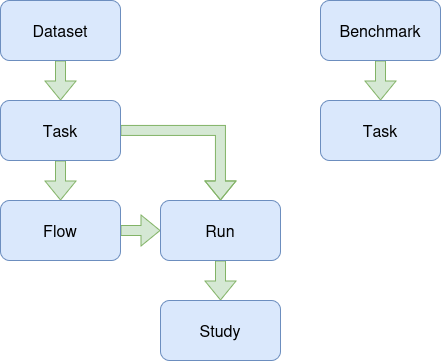

# OpenML Python API Tutorial (Sept 2026)
_Laith Agbaria and the OpenML Team_

> “OpenML is an online platform for open science collaboration in machine learning, used to share datasets and results of machine learning experiments.”  
> — [Feurer et al. (2021)](https://jmlr.org/papers/volume22/19-920/19-920.pdf)

This tutorial is intended to introduce you to the [OpenML](https://www.openml.org/) Python API, giving you detailed examples of how to use various functionalities necessary to utilize the existing tools.
There are two jupyter notebooks associated with this tutorial that first show the various functions through examples and then provide guided exercises to develop skills, we hope that you use the test (or a [docker local](https://github.com/openml/services)) server throughout the tutorial so as not to populate the main website with tutorial examples.
If you encounter any issues during this tutorial or have any recommendations after completing it, contact us through the [official Slack channel](https://openml.slack.com), your experience matters to us and those who will start with the tutorial later on.

There is currently no advanced usage tutorial, however a detailed [documentation](https://openml.github.io/openml-python/latest) should offer answers to most queries, you could also contact us through the [official Slack channel](https://openml.slack.com) or in one of the [hackathons](https://openml.org/meet).

### Prerequisites
To follow this tutorial, you will need:
- Python 3.10+ for the most recent OpenML versions,
- Jupyter notebook (can run in Google Colab),
- Python package environment, such as `uv`,  `pip` with `venv` or Anaconda,
- OpenML Python package version 0.15.1,
- (Recommended) OpenML account.

### OpenMLBase
The `OpenMLBase` class exists at the core of the OpenML-Python object model. It is a parent class for several OpenML objects, including datasets, tasks, flows, runs, and studies.
Through this shared base class, OpenML objects have common functionality such as an identifier and URL, and can interact with OpenML tags. OpenML objects can also provide a direct link to their corresponding page on the OpenML website.

It is useful to keep this common interface in mind because many OpenML objects behave similarly even though they represent different parts of the machine-learning workflow.

### Test server
There is a test version of the OpenML server intended for learning and development. It is designed to behave similarly to the main server while keeping tutorial and development uploads separate from the public OpenML website.

We recommend using the test server for uploads during this tutorial. This allows you to experiment with publishing datasets, flows, runs, and other objects without adding tutorial examples to the main OpenML server.
```python
import openml
openml.config.start_using_configuration_for_example()
# ...
openml.config.stop_using_configuration_for_example()
```
The configuration helper temporarily switches the API configuration to the test configuration (which includes a valid API key) and restores the previous configuration afterwards.

## OpenML object model
Before looking at individual API calls, it is helpful to understand how the main OpenML objects relate to one another.

This could be shown in simplified view as:

> 
> — [draw.io](https://draw.io/)

A **dataset** contains data and metadata.

A **task** describes how that dataset should be used for a particular machine-learning problem, including the task type, target, data splits, and evaluation procedure.

A **flow** describes a runnable machine-learning method or pipeline.

A **run** records the result of applying a flow to a task, including its parameter settings, predictions, and evaluations.

A **study** groups related OpenML objects, while a **benchmark** suite is a specific kind of study containing a curated collection of tasks.

This separation is important for reproducibility: the dataset describes the data, the task describes the experimental protocol, the flow describes what is run, and the run records what actually happened.

## Datasets
OpenML datasets are standardized datasets hosted on the OpenML platform. Each dataset contains the data itself together with metadata describing its structure and intended use. This metadata can include the dataset name, identifier, version, description, authors or contributors, feature information, target attribute, number of instances, licensing information, tags, and data-quality properties.

This standardization makes datasets easier to discover, share, download, and use consistently across machine-learning experiments.

### Listing datasets
Shown in the examples notebook is the listing of datasets using the function `openml.dataset.list_datasets()`, you could provide a list of dataset IDs to limit the search.
By default this function returns a Python dictionary, however this is planned to change in later versions into a pandas DataFrame and  could already be achieved by using the parameter `output_format='dataframe'`.

### Getting datasets
When using `openml.datasets.get_dataset()` to load a dataset, it creates a cache in the directory `openml.config.get_cache_directory()`. The function itself accepts the integer ID of a dataset or the string name, setting the parameter `download_data=True` will result in an attempt to download a Paraquet version if it exists, if no version exists then it will fall back to downloading the ARFF version. Setting the `OPENML_SKIP_PARAQUET_ENV_VAR` to `true` in the OpenML package environment would lead to the same result.

### Loading data
OpenML datasets typically come with a `default_target_attribute`, which can be used to directly separate the target data from the features data when using `get_data(target)`.  By default this function already returns a pandas DataFrames, and has four outputs (features, target, categorical indicator, attribute names).

In the example this is show as:
```python
X, y, categorical_indicator, attribute_names = dataset.get_data(
    target=dataset.default_target_attribute)
```
If no target is provided, all the data will be added to the features `X`.

### Metadata
Metadata can be accessed directly from the dataset object. For example:
```python
dataset.name
dataset.description
dataset.default_target_attribute
dataset.version
dataset.licence
```
Additional information is available through properties such as the dataset's features and qualities.
When loading data through `sklearn.datasets.fetch_openml()`, the returned object is a dictionary and thus the metadeta is accessible through `dataset.details`.

### Publishing datasets
Publishing a dataset is different from simply downloading one. Uploading content to OpenML requires authentication with an API key, and the dataset needs to be published before it can be used within a normal OpenML framework.

A new dataset can be constructed locally, populated with metadata and data, and then published to OpenML. The exact upload workflow is demonstrated in the examples notebook.

When publishing a dataset, pay particular attention to its metadata. A useful description, correct target attribute, appropriate licensing information, and meaningful tags make a dataset easier for other users to understand and reuse.
Published datasets can also be forked, allowing users to create their own version of an existing dataset. Datasets could also be modified by their owners, however if they are being used by a task then those changes can be limited.

If you would like to delete a dataset you own, then you must first detach it from all tasks.

## Tasks
OpenML tasks are standardized combinations of datasets and machine-learning objectives, such as supervised classification. Each task contains a dataset as well as the data splits which could be used during experimental runs, together with information regarding task type, estimation procedure, and estimation measure.

Tasks can be listed, filtered, and gotten in the same manner as datasets with minor differences, such as `openml.tasks.list_tasks()` accepting a keyword argument for `task_type` and `openml.tasks.get_task()` only accepting the task ID and having the option to download an arff with data-split information.
The function `openml.tasks.get_task()` can also forward keyword arguments to the associated dataset.

### Dataset from task
The dataset associated with the task can be extracted using the method `get_dataset()`, which works exactly the same as the `openml.datasets.get_dataset()` but the datataset ID is directly passed.
The features and target data can be directly obtained using the method `get_X_and_y()` (or just `get_X()` for ClusteringTask).

### Data splits
As different task types require different amounts of repeats, folds, and samples, you can use the method `get_split_dimensions()` to know these values for a loaded task. This infomration can then be used in the method `get_train_test_split_indices()` to determine which exact indices to be used, setting up for reproducible runs.

The associated examples notebook shows how this can be used directly, and will be developed to include examples of creating, publishing, editing, and deleting tasks (which requires it to have no associated runs or studies).

## Flows and runs

## Studies

## Benchmark suites

# References
- OpenML. OpenML: The Open Machine Learning Platform. https://www.openml.org/

- Feurer, M., van Rijn, J. N., Kadra, A., Gijsbers, P., Mallik, N., Ravi, S., Müller, A., Vanschoren, J., & Hutter, F. (2021). OpenML-Python: An extensible Python API for OpenML. Journal of Machine Learning Research, 22, 1–5. https://jmlr.org/papers/volume22/19-920/19-920.pdf

- JGraph. diagrams.net. Version 31.4.6. JGraph Ltd, 2026. https://app.diagrams.net/

- OpenML-Python documentation. https://openml.github.io/openml-python/latest/

- OpenML-Python source repository. https://github.com/openml/openml-python/
